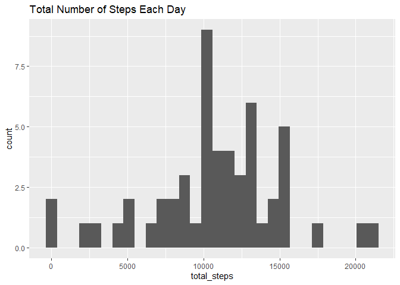
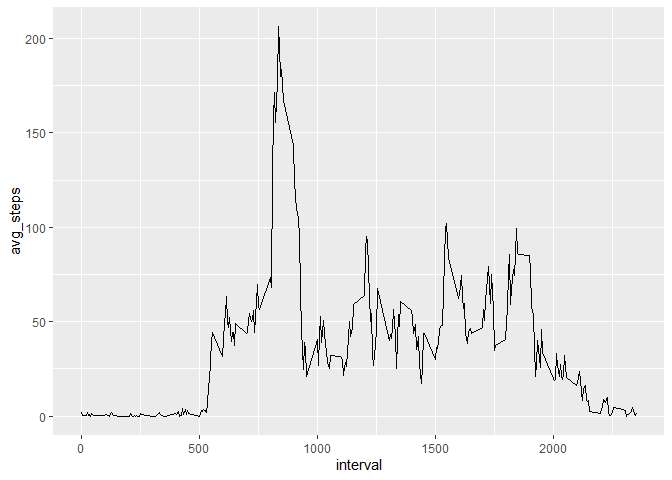
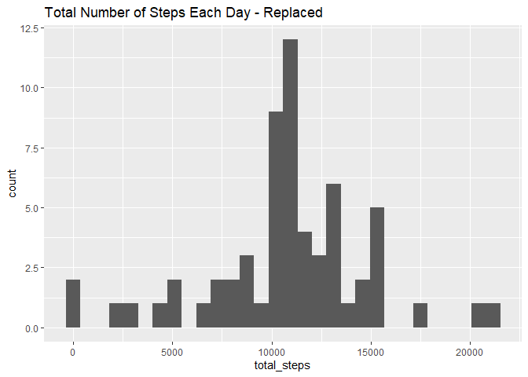
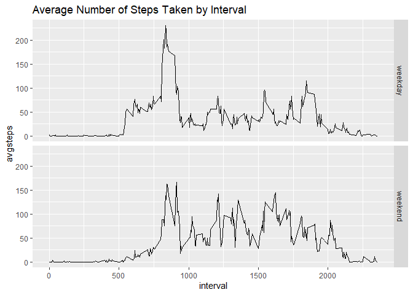

## Loading and preprocessing the data

```r
library(dplyr)
```

```
## 
## Attaching package: 'dplyr'
```

```
## The following objects are masked from 'package:stats':
## 
##     filter, lag
```

```
## The following objects are masked from 'package:base':
## 
##     intersect, setdiff, setequal, union
```

```r
library(ggplot2)
activity <- read.csv('activity.csv')
```


## What is mean total number of steps taken per day?

```r
total_steps_byday <- activity %>% group_by(date) %>% summarise(total_steps = sum(steps))

ggplot(data = total_steps_byday, mapping= aes(x = total_steps)) + geom_histogram() + ggtitle("Total Number of Steps Each Day")
```

```
## `stat_bin()` using `bins = 30`. Pick better value with `binwidth`.
```

```
## Warning: Removed 8 rows containing non-finite values (stat_bin).
```

<!-- -->

```r
mean_actvity <- mean(total_steps_byday$total_steps, na.rm = TRUE)
print(paste('Mean number of steps per day: ', mean_actvity))
```

```
## [1] "Mean number of steps per day:  10766.1886792453"
```

```r
median_activity <- median(total_steps_byday$total_steps, na.rm = TRUE)
print(paste('Median number of steps per day: ', median_activity))
```

```
## [1] "Median number of steps per day:  10765"
```

## What is the average daily activity pattern?

```r
interval_avgsteps <- activity %>% group_by(interval) %>% summarise(avg_steps = mean(steps, na.rm = TRUE))

ggplot(data = interval_avgsteps, mapping = aes(x = interval, y = avg_steps)) + geom_line()
```

<!-- -->

```r
print(paste('Maximum step interval is at', interval_avgsteps[which.max(interval_avgsteps$avg_steps),1]))
```

```
## [1] "Maximum step interval is at 835"
```

## Imputing missing values

```r
total_missing <- sum(is.na(activity$steps))
print(paste('Total Missing Values:',total_missing))
```

```
## [1] "Total Missing Values: 2304"
```

```r
activity_list <- split(activity, activity$interval)
for(i in 1:288){
  activity_list[[i]]$steps <- ifelse(is.na(activity_list[[i]]$steps), mean(activity_list[[i]]$steps,na.rm = TRUE), activity_list[[i]]$steps)
}

activity_replace <- do.call('rbind', activity_list)
row.names(activity_replace) <- NULL

total_steps_replace <- activity_replace %>% group_by(date) %>% summarise(total_steps = sum(steps))

ggplot(data = total_steps_replace, mapping = aes(x = total_steps)) + geom_histogram() + ggtitle("Total Number of Steps Each Day - Replaced")
```

```
## `stat_bin()` using `bins = 30`. Pick better value with `binwidth`.
```

<!-- -->

```r
mean_actvity_replace <- mean(total_steps_replace$total_steps)
print(paste('Mean number of steps per day: ', mean_actvity_replace))
```

```
## [1] "Mean number of steps per day:  10766.1886792453"
```

```r
median_activity_replace <- median(total_steps_replace$total_steps)
print(paste('Median number of steps per day: ', median_activity_replace))
```

```
## [1] "Median number of steps per day:  10766.1886792453"
```
By filling in the missing values with the average, 

## Are there differences in activity patterns between weekdays and weekends?

```r
activity_replace$date <- as.Date(activity_replace$date)
activity_replace$weekday <- ifelse(weekdays(activity_replace$date) %in% c('Saturday', 'Sunday'), 'weekend', 'weekday')

weekday_avgsteps <- activity_replace %>% group_by(interval, weekday) %>% summarise(avgsteps = mean(steps))

ggplot(data = weekday_avgsteps, mapping = aes(x = interval, y = avgsteps)) + geom_line() + facet_grid(weekday ~.) + ggtitle("Average Number of Steps Taken by Interval")
```

<!-- -->

